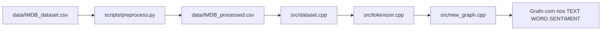

# Analise de Sentimentos de Avaliacoes de Filmes com Grafos

Projeto da disciplina que usa o dataset do IMDB para representar avaliacoes de filmes como um grafo. A ideia central e transformar reviews, palavras e rotulos de sentimento em nos conectados, para depois explorar essas relacoes na classificacao.

## Visao geral

O projeto segue um fluxo hibrido:

- Python prepara o texto do dataset.
- C++ constroi e povoa o grafo.

Essa divisao foi escolhida porque o preprocessamento linguistico com lematizacao e bem mais simples com SpaCy, enquanto a estrutura de dados principal foi implementada em C++.

## Fluxo de informacoes



## O que o preprocessamento faz

O script [scripts/preprocess.py](scripts/preprocess.py) le o arquivo `data/IMDB_dataset.csv` e gera `data/IMDB_processed.csv`.

Durante esse passo, cada review passa por:

- tokenizacao com SpaCy
- remocao de stopwords
- remocao de artigos como `a`, `an` e `the`
- remocao de tokens que nao sao alfabeticos
- lematizacao
- conversao para minusculas

O arquivo final salvo pelo Python contem apenas duas colunas:

- `processed`: texto limpo e lematizado
- `sentiment`: rotulo original da review

Importante:
o script nao reprocessa o dataset se `data/IMDB_processed.csv` ja existir. Se voce quiser gerar o arquivo novamente, rode:

```bash
py -3 scripts/preprocess.py --force
```

## Como o grafo e montado

O programa em C++ cria tres tipos de nos:

- `TEXT`: uma review processada
- `WORD`: uma palavra da review
- `SENTIMENT`: um rotulo de sentimento

Hoje os nos de sentimento criados sao:

- `POSITIVO`
- `NEGATIVO`
- `NEUTRO`

Na pratica, o fluxo atual do dataset usa apenas `positive` e `negative`.

Para cada review lida em [src/dataset.cpp](src/dataset.cpp), o programa:

1. cria um no do tipo `TEXT`
2. identifica o sentimento da review
3. conecta `TEXT -> SENTIMENT`
4. separa as palavras do texto processado
5. cria ou reaproveita um no `WORD` para cada palavra
6. conecta `TEXT -> WORD`
7. conecta `WORD -> SENTIMENT`

As arestas sao armazenadas em lista de adjacencia e possuem peso. Quando a mesma conexao aparece novamente, o peso da aresta aumenta.

## Estrutura do projeto

```text
data/
  IMDB_dataset.csv
  IMDB_processed.csv
scripts/
  preprocess.py
src/
  main.cpp
  dataset.cpp
  dataset.hpp
  tokenizer.cpp
  tokenizer.hpp
  new_graph.cpp
  new_graph.hpp
makefile
requirements.txt
```

## Como executar

### 1. Preparar dependencias Python

```bash
make setup
```

Esse alvo instala:

- `pandas`
- `spacy`
- `tqdm`
- modelo `en_core_web_sm`

### 2. Gerar o dataset processado

```bash
make preprocess
```

### 3. Compilar o codigo C++

```bash
make build
```

### 4. Rodar o projeto completo

```bash
make run
```

O alvo `run` executa o preprocessamento antes da aplicacao, mas so vai gerar o CSV processado se ele ainda nao existir.

## Implementacao atual

O estado atual do projeto ja cobre:

- preprocessamento do dataset em Python
- leitura do dataset processado em C++
- construcao do grafo com reviews, palavras e sentimentos
- reutilizacao de nos de palavras por meio de um dicionario
- acumulacao de peso nas arestas repetidas
- limite atual de leitura em 10.000 reviews

## Limitacoes atuais

- o no `NEUTRO` e criado, mas nao e usado pelo dataset atual
- o projeto constroi o grafo, mas ainda nao aplica uma etapa final de classificacao automatica
- nao ha testes automatizados no repositorio

## Bibliotecas usadas

### Python

- `pandas`
- `spacy`
- `tqdm`

### C++

- `iostream`
- `fstream`
- `vector`
- `string`
- `map`
- `sstream`
- `cctype`

